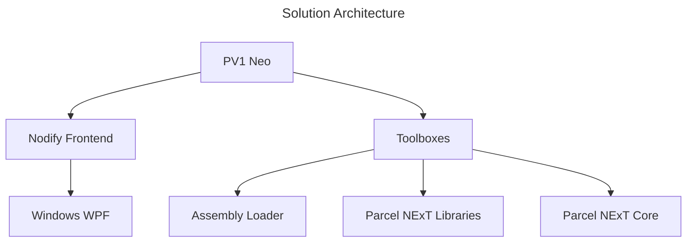

# PV1 Neo

Version: PV1 Neo v0.1.0  
Last Update: 2024-009

Windows-only front-end for Parcel NExT ecosystem, a visual programming platform. This implementation is for development purpose and lightweight usage and covers only subset of POS features. It's node-only Windows-only. It would suffice for the purpose of testing libraries and showcasing the core software aspects of Parcel workflows.

Below is an overview of earlier versions:

|Version|Parcel Original Prototype|PV1|PV1 Neo|
|-|-|-|-|
|Description|Original concept,  including dashboard component,  based on ASP.Net Core (hybrid mode).|Cleaned up version of original concept,  migrated to .Net 8.|Latest attempt to make it POS compliance, Official Windows frontend.|
|Status|Archive Only|Maintenance Only|Active Use|
|Feature Set|Demo Only|Demo Only|Partially POS Compliant; Full PSL|
|Dashboard Feature|Native|N/A|N/A|
|Link|[Link](https://github.com/Charles-Zhang-Parcel/Parcel_V1_Prototype)|[Link](https://github.com/Charles-Zhang-Parcel/Parcel_V1)|[Link](https://github.com/Charles-Zhang-Parcel/PV1_Neo)|

## Setup

All key components are implemented inside `Parcel.Neo.Shared` assembly, the front end is implemented in `Parcel.Neo`, and all functional components are implemented in various **Toolboxes**.

1. Simply open `.sln` solution
2. Run `Parcel.Neo` project

### To Add New Functionalities

Either inherit a class, or use shortcut methods. In the future, if we shall implement a way to load from assemblies automatically, it would make things way easier and allow interoperation from Parcel NExT.

## Management

The corresponding ADO Epic for this is: https://dev.azure.com/ParcelEngine/Parcel/_workitems/edit/347
This particular project is outside of scope for Parcel NExT but is otherwise very relevant for library prototyping and client demonstration purposes.

For proper utilization of this project as a framework, one must follow guidelines as to integration with Parcel NExT (except for one-shot purposes).

### TODO

Pending migrating below tasks to ADO:

- [ ] (Maintenance) Upgrade framework to latest .Net 8
- [ ] (Maintenance) Implement custom binary serializer due to deprecation of .Net 6 BinaryFormatter
- [ ] (Tooling) Implement a simple "loader" utility that allows consumption of raw C# libraries from the Parcel NExT side for a smoother development process
