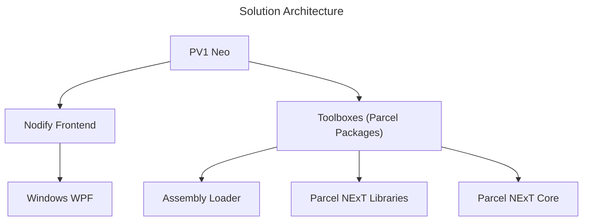

# PV1 Neo

Version: PV1 Neo v0.1.0  
Last Update: 2024-06-18
Status: Active Development

<!--There are two ways of making PV1 Neo POS-Compliant: Base entire runtime directly on Parcel NExT; Provides dedicated PackageLoader to allow consumption of Parcel NExT packages. The latter can be considered a small step towards eventual "rebasing".-->

Windows-only front-end for Parcel NExT, a visual programming platform. This implementation is for development purpose, lightweight usage, beta tests, and covers only subset of POS features. It's node-only Windows-only and doesn't support advanced graph-native constructs. It would suffice for the purpose of testing libraries and showcasing the core software aspects of Parcel workflows. This setup also directly embeds the Ama runtime, and (at least in beta tests) make direct reference/dependency on available toolboxes.

PV1 is implemented using WPF, it's single-process model (contrast to server-client model) and the graph editor is not as flexible as Gospel, so it may not support full sets of (front-end) capabilities of Gospel. Despite that, we try as much as possible to be full POS-compliant<!--and it's also important for POS to clarify which parts are formal standards and which parts are just front-end features-->. Below table summarizes main capabilities of PV1 when compared to other front-ends.

Below is an overview of earlier versions:

|Version|Parcel Original Prototype|PV1|PV1 Neo|
|-|-|-|-|
|Description|Original concept,  including dashboard component,  based on ASP.Net Core (hybrid mode).|Cleaned up version of original concept,  migrated to .Net 8.|Latest attempt to make it POS compliance, Official Windows frontend.|
|Status|Archive Only|Maintenance Only|Active Use|
|Feature Set|Demo Only|Demo Only|Partially POS Compliant; Full PSL|
|Dashboard Feature|Native|N/A|N/A|
|Link|[Link](https://github.com/Charles-Zhang-Parcel/Parcel_V1_Prototype)|[Link](https://github.com/Charles-Zhang-Parcel/Parcel_V1)|[Link](https://github.com/Charles-Zhang-Parcel/PV1_Neo)|

**Overview**
|Front-end|PV1 Neo|Pure 2|Gospel|
|-|-|-|-|
|Full POS Compliant|✔|✘|✔|
|Partially POS Compliant|✔|✔|✔|
|Full GUI Features|✘|✘|✔|

**Specific features**
|Front-end|PV1 Neo|Pure 2|Gospel|
|-|-|-|-|
|Subgraphs|✔|✘|✔|
|PSL Interoperation|✔|✔|✔|
<!-- PENDING REFINEMENT -->

## Setup

All key components are implemented inside `Parcel.Neo.Base` assembly, the front end is implemented in `Parcel.Neo`, and all functional components are implemented in various **Toolboxes** (will soon be completely replaced by Parcel packages).

1. Simply open `.sln` solution
2. Run `Parcel.Neo` project

(TODO: Provide download instruction)

## Management

The corresponding ADO Epic for this is: https://dev.azure.com/ParcelEngine/Parcel/_workitems/edit/347
This particular project is outside of (the formal) scope for Parcel NExT but is otherwise very relevant for library prototyping and client demonstration purposes - with proper development, it can have its own place in the Parcel NExT ecosystem.

For proper utilization of this project as a framework, one must follow guidelines as to integration with Parcel NExT (except for one-shot purposes).

### TODO

Pending migrating below tasks to ADO: <!--Delete those when done-->

- [x] (Maintenance) Upgrade framework to latest .Net 8
- [x] (Maintenance) Implement custom binary serializer due to deprecation of .Net 6 BinaryFormatter
- [ ] (Tooling) Implement a simple "loader" utility that allows consumption of raw C# libraries from the Parcel NExT side for a smoother development process

Areas:
- [ ] Add dependency on Parcel NExT core (from NuGet)
- [ ] Package Manager
- [ ] Image Preview (for plotting visualization support)
- [ ] Plotting (from PSL)
- [ ] (PSL side work) Workloads (pack of packages)
- [ ] Serialization

Publishing:
- [ ] Create application icon

## Development

### Loading Parcel Packages

PENDING.

### Loading C# Assemblies

PENDING.

### To Add New Functionalities

Either inherit a class, or use shortcut methods. In the future, if we shall implement a way to load from assemblies automatically, it would make things way easier and allow interoperation from Parcel NExT.

## References

See **Programming with Parcel** textbook.